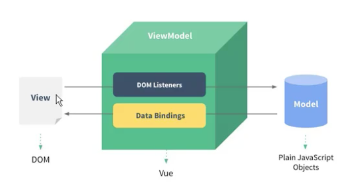

### vue里的MVVM

* view层指的是视图层，在前端开发中，通常就是DOM层，主要的作用是给用户展示各种信息。

* Model层指的是数据层，数据可能是死数据，但是更多的是通过网络请求下载下来的数据。

* ViewModel层指的是视图模型层，是View和Model沟通的桥梁。一方面实现Data Binding数据绑定，将Model得改变实时反应到View中，另一方面它实现了DOM Listrner,也就是DOM监听，当DOM发生一些点击事件（点击、滚动、touch等）时，可以监听到，并在需要的情况下改变对应的Data.