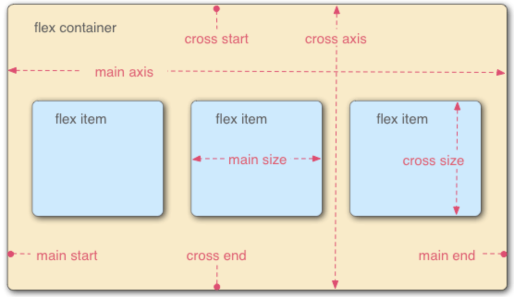
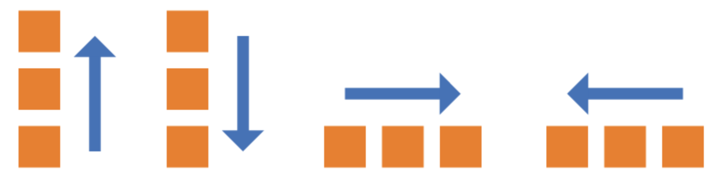
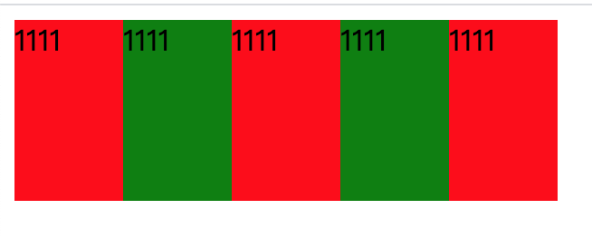
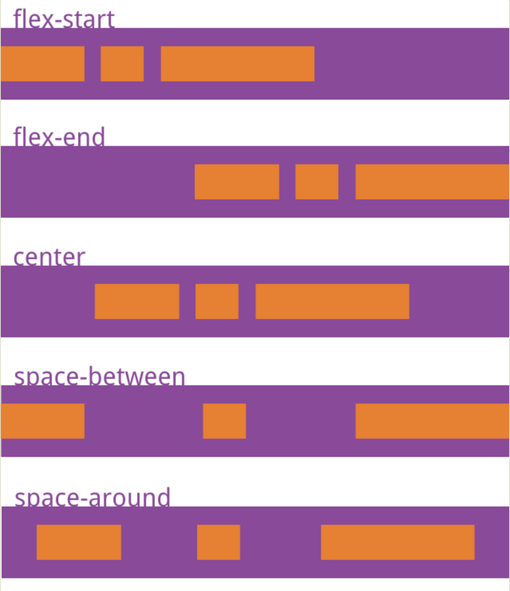
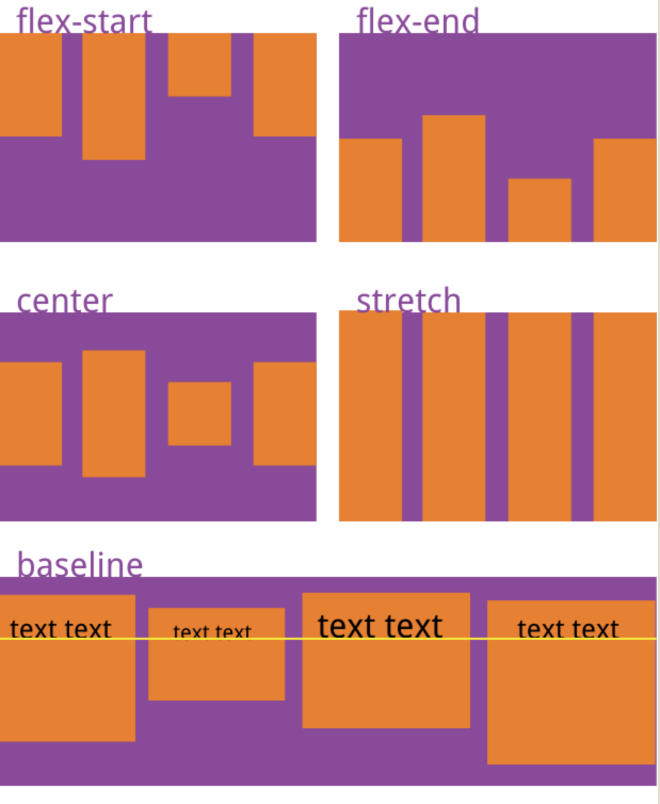
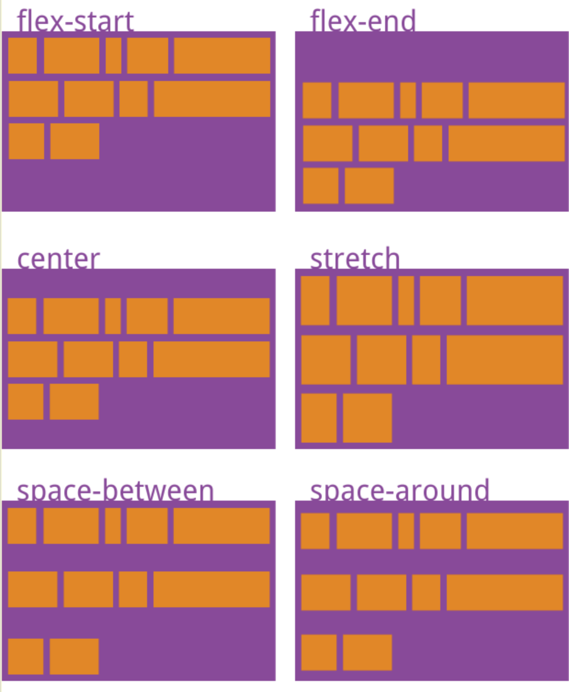

网页布局是css的一个重点应用，布局的传统解决方案，是基于盒模型，依赖display+position+float属性。

2009年w3c提出了一种新的方案：flax布局，可以简便，完整，响应式地实现各种页面布局，目前，它已经得到了所有主流浏览器的支持（ie10以下除外）

flax是Flaxible Box的缩写，意为弹性布局，用来为盒模型提供最大的灵活性。采用flex布局的元素，称为flex container，简称为容器，它的所有子元素自动成为容器成员，称为flex item

任何一个容器都可以指定为flax布局,我们可以使用以下方式来开启flax布局：

```
.box{
	display:flax
}
```

行内元素也可以使用flax布局：

```
.box{
	display:inline-flax;
}
```

webkit内核的浏览器，必须加上-webkit前缀

```
.box{
  display: -webkit-flex; /* Safari */
  display: flex;
}
```

> 在设为 Flex 布局以后，子元素的float、clear和vertical-align属性将失效。


## 基本概念



容器默认存在两根轴，水平方向的称为主轴：main axis，垂直方向的称为交叉轴cross axis,主轴开始的位置叫做main start,结束的位置叫main end,交叉轴开始的位置叫cross axis,结束的位置叫cross end。默认沿着主轴排列，单个项目占据的主轴空间叫main size,占据的交叉轴空间叫做cross size。

## 容器的属性

容器共有以下六个属性：

* flex-direction
* flex-wrap
* flex-flow
* justify-content
* align-items
* align-content

#### flex-direction

flex-direction是用来决定主轴方向的，也就是说，它有四个值，分别是：

* row:主轴为水平方向,水平方向从左到右排列
* row-reverse:主轴为水平方向,水平方向从右到左
* column:主轴为垂直方向,垂直方向从上到下
* colomn:主轴为垂直方向,垂直方向从下到上




#### flex-wrap

默认情况下，项目都排列在一条轴线上不换行，比如flex container的宽度为300px,但每个flex item的宽度为100px,共5个，那么这5个item会平分300px,宽度挤为60px,如下图：



flex-wrap就是一个定义item换行的属性，它有三个值：

* nowrap:默认值，不换行
* wrap:换行，第一行在上方
* wrap-reverse:换行，第一行在下方


#### flex-flow

flex-flow属性是flex-direction和flex-wrap的简写，默认值为row nowrap.

```
.box {
  flex-flow: <flex-direction> || <flex-wrap>;
}
```

#### justify-content

justify-content属性定义了项目在主轴上的对其方式，它有5个值：

* flex-start:默认值，左对其，无间距
* flex-end:右对其
* center:居中
* space-between:两端对其，item之间的间隔相等
* space-around:每个item两侧的间隔相等，相当于给item加了一个magin-left和magin-right的属性，所以就产生了item之间的间距等于item和边框之间的间距的两倍



#### align-items

align-items定义item在交叉轴上的对齐方式，（就是justify-content的竖版）

* flex-start：设置了高度时的默认值，交叉轴的起点对齐。
* flex-end：交叉轴的终点对齐。
* center：交叉轴的中点对齐。
* baseline: 项目的第一行文字的基线(底线)对齐。
* stretch：未设置高度时的默认值，如果项目未设置高度或设为auto，将占满整个容器的高度。




#### align-content

align-content定义了多根轴线的对齐方式，如果项目只有一根轴线，该属性不起作用。

* flex-start：与交叉轴的起点对齐。
* flex-end：与交叉轴的终点对齐。
* center：与交叉轴的中点对齐。
* space-between：与交叉轴两端对齐，轴线之间的间隔平均分布。
* space-around：每根轴线两侧的间隔都相等。所以，轴线之间的间隔比轴线与边框的间隔大一倍。
* stretch（默认值）：轴线占满整个交叉轴。

