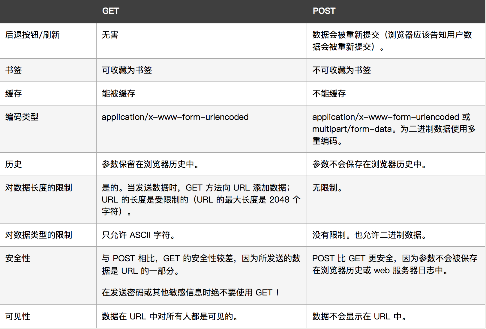

Ajax是Asynchronous JavaScript and XML的缩写，这一技术可以向服务器请求额外的数据而无需重新加载页面，会带来更好的用户体验。

Ajax的核心技术就是XMLHTTPRequest对象，简称XHR，这是由微软首先引入的一个新特性，其他浏览器商后来都提供了相同的实现。

## XMLHttpRequest

IE7+,Firefox,Opera,Chrome,Safari都支持原生的XHR对象，我们需要通过以下代码来实现网络请求：

发送 Ajax 请求的五个步骤：

（1）创建异步对象。即 XMLHttpRequest 对象。

（2）使用open方法设置请求的参数。open(method, url, async)。参数解释：请求的方法、请求的url、是否异步(布尔值),第三个参数可省略，一般网络请求都是要异步的，所以默认为true。

（3）发送请求。

（4）注册事件。 注册onreadystatechange事件，状态改变时就会调用。

如果要在数据完整请求回来的时候才调用，我们需要手动写一些判断的逻辑。

（5）获取返回的数据。


在收到相应后，相应的数据会自动填充XHR对象的属性，相关属性如下：

* responseText:作为相应主体被返回的文本
* responseXML:如果相应的内容类型是"text/xml"或"application/xml"，这个属性中将保存着响应数据的XML DOM文档。
* status:相应的Http状态
* statusText:Http状态的说明

在接收到响应后，第一步是检查status属性，以确认响应已经成功返回，我们可以将HTTP的状态码为200作为成功的标志，此时，responseText已经准备就绪可以访问了。

接下来，我们可以检测XHR对象的readyState属性，该属性表示请求响应过程的活动阶段，这个属性可取的值如下：

0：未初始化，尚未调用open()方法。

1：启动，已经调用open()方法，但是尚未调用send()方法。

2：发送，已经调用send()方法，但尚未接收响应。

3：接收：已经接收到部分响应数据。

4：完成：已经接收到所有响应数据，并且可以在客户端使用了。

readyState属性的值每一次变化，都会触发一次readystatechange事件，通常，我们只对他的值为4时感兴趣，因为这时候所有数据已经准备就绪。


```
<!DOCTYPE html>
<html lang="en">
<head>
    <meta charset="UTF-8">
    <title>Document</title>
</head>
<body>
<h1>Ajax 发送 get 请求</h1>
<input type="button" value="发送get_ajax请求" id='btnAjax'>

<script type="text/javascript">
    // 绑定点击事件
    document.querySelector('#btnAjax').onclick = function () {
        // 发送ajax 请求 需要 五步

        // （1）创建异步对象
        var ajaxObj = new XMLHttpRequest();

        // （2）设置请求的参数。包括：请求的方法、请求的url,是否异步发送请求（该参数可省略，默认为true）。
        ajaxObj.open('get', 'https://api.github.com/users');

        // （3）发送请求
        ajaxObj.send();

        //（4）注册事件。 onreadystatechange事件，状态改变时就会调用。
        //如果要在数据完整请求回来的时候才调用，我们需要手动写一些判断的逻辑。
        ajaxObj.onreadystatechange = function () {
            // 为了保证 数据 完整返回，我们一般会判断 两个值
            if (ajaxObj.readyState == 4 && ajaxObj.status == 200) {
                // 如果能够进到这个判断 说明 数据 完美的回来了,并且请求的页面是存在的
                // 5.在注册的事件中 获取 返回的 内容 并修改页面的显示
                console.log('数据返回成功');

                // 数据是保存在 异步对象的 属性中
                console.log(ajaxObj.responseText);

                // 修改页面的显示
                document.querySelector('h1').innerHTML = ajaxObj.responseText;
            }
        }
    }
</script>
</body>
</html>
```

在接收到响应之前，我们可以通过abort()来取消异步请
求。如下所示：

xhr.abort()

调用这个方法后，XHR对象会停止触发事件，而且也不再允许访问任何与响应有关的对象属性。由于内存原因，不建议重用XHR对象。


### HTTP头部信息

使用setRequestHeader(头部字段的名称，头部字段的值)可以设置自定义的请求头部信息，这个方法接收两个参数：头部字段的名称，头部字段的值。

要成功发送头部信息，需要在调用open()方法之后，send()方法之前调用。

### get和post
GET 和 POST 只是 HTTP 协议中两种请求方式（异曲同工），而 HTTP 协议是基于 TCP/IP 的应用层协议，无论 GET 还是 POST，用的都是同一个传输层协议，所以在传输上，没有区别。

报文格式上，不带参数时，最大区别就是第一行方法名不同, 仅仅是报文的几个字符不同而已

POST 方法请求报文第一行是这样的 POST /url HTTP/1.1 GET 方法请求报文第一行是这样的 GET /url HTTP/1.1

带参数时报文的区别呢？ 在约定中，GET 方法的参数应该放在 url 中，POST 方法参数应该放在 body 中。

我们来看一下w3c文档关于get和Post的区别：



关于安全的问题，官方说POST比GET安全，因为数据在地址栏上不可见。

然而，从传输的角度来说，他们都是不安全的，因为 HTTP 在网络上是明文传输的，只要在网络节点上捉包，就能完整地获取数据报文。

要想安全传输，就只有加密，也就是 HTTPS。

从性能的角度来讲，发送相同的数据，get的请求速度最多可以达到post请求的两倍。也就是说，post请求会消耗更多的资源。

### Ajax的优缺点：

#### Ajax的优点

   **1）页面无刷新更新数据：**
   AJAX最大优点就是能在不刷新整个页面的前提下与服务器通信维护数据。这使得Web应用程序更为迅捷地响应用户交互，并避免了在网络上发送那些没有改变的信息，减少用户等待时间，带来非常好的用户体验。

   **2）异步与服务器通信：**
   AJAX使用异步方式与服务器通信，不需要打断用户的操作，具有更加迅速的响应能力。优化了Browser和Server之间的沟通，减少不必要的数据传输、时间及降低网络上数据流量。

  **3）前端和后端负载平衡：**
  AJAX可以把以前一些服务器负担的工作转嫁到客户端，利用客户端闲置的能力来处理，减轻服务器和带宽的负担，节约空间和宽带租用成本。并且减轻服务器的负担，AJAX的原则是“按需取数据”，可以最大程度的减少冗余请求和响应对服务器造成的负担，提升站点性能。

 **4）基于标准被广泛支持：**
 AJAX基于标准化的并被广泛支持的技术，不需要下载浏览器插件或者小程序，但需要客户允许JavaScript在浏览器上执行。随着Ajax的成熟，一些简化Ajax使用方法的程序库也相继问世。同样，也出现了另一种辅助程序设计的技术，为那些不支持JavaScript的用户提供替代功能。

  **5）界面与应用分离：**
  Ajax使WEB中的界面与应用分离（也可以说是数据与呈现分离），有利于分工合作、减少非技术人员对页面的修改造成的WEB应用程序错误、提高效率、也更加适用于现在的发布系统。

#### AJAX  的缺点

  **1）AJAX 取消浏览器Back和History功能，即对浏览器机制的破坏：**
  在动态更新页面的情况下，用户无法回到前一个页面状态，因为浏览器仅能记忆历史记录中的静态页面。一个被完整读入的页面与一个已经被动态修改过的页面之间的差别非常微妙；用户通常会希望单击后退按钮能够取消他们的前一次操作，但是在Ajax应用程序中，这将无法实现的 ，后退按钮是一个标准的web站点的重要功能，但是它没法和js进行很好的合作。这是Ajax所带来的一个比较严重的问题，

  **2）AJAX的安全问题：**
  AJAX技术给用户带来很好的用户体验的同时也对IT企业带来了新的安全威胁，Ajax技术就如同对企业数据建立了一个直接通道。这使得开发者在不经意间会暴露比以前更多的数据和服务器逻辑。Ajax的逻辑可以对客户端的安全扫描技术隐藏起来，允许黑客从远端服务器上建立新的攻击。还有Ajax也难以避免一些已知的安全弱点，诸如跨站点脚步攻击、SQL注入攻击和基于Credentials的安全漏洞等等

**3）对搜索引擎支持较弱：**
对搜索引擎的支持比较弱。如果使用不当，AJAX会增大网络数据的流量，从而降低整个系统的性能。

**4）破坏程序的异常处理机制：**
至少从目前看来，像Ajax.dll，Ajaxpro.dll这些Ajax框架是会破坏程序的异常机制的

**5）违背URL和资源定位的初衷：**
我给你一个URL地址，如果采用了Ajax技术，也许你在该URL地址下面看到的和我在这个URL地址下看到的内容是不同的。这个和资源定位的初衷是相背离的

**6）AJAX不能很好支持移动设备：**
一些手持设备（如手机、PAD等）现在还不能很好的支持Ajax

**7）客户端过肥，太多客户端代码造成开发上的成本：**
编写复杂、容易出错 ；冗余代码比较多（层层包含js文件是AJAX的通病，再加上以往的很多服务端代码现在放到了客户端）；破坏了Web的原有标准。

**8）如果用户禁用了JS，网站就取不到数据**
