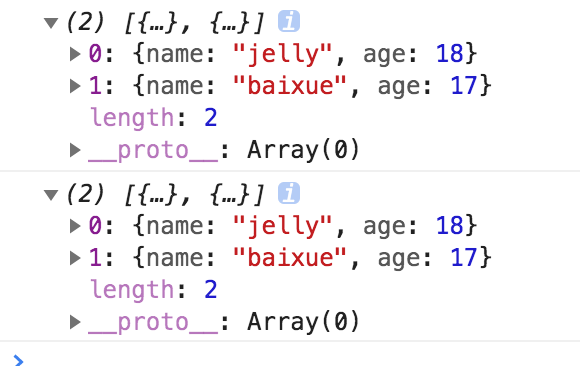
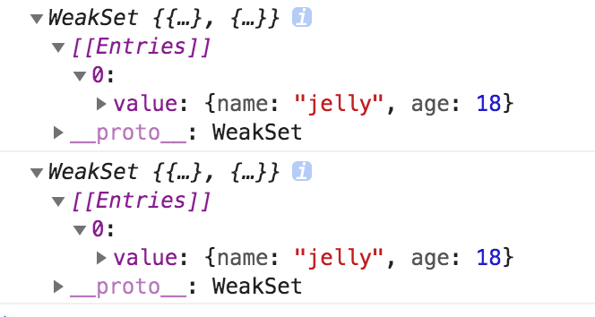

## Set

set可以看做是唯一的数组，你只能添加一个元素一次，这就意味着你添加重复的元素时它不会有任何的反应。set不能通过索引获取值。

* .add 添加元素
* .delete 删除元素
* .has 判断是否有某一个元素
* .clear 清除所有元素

```
const colors = new Set(["red","green","blue"])
colors.add("white")
colors.add("black")
colors.delete("white")
colors.has("white")
colors.clear()
```

借助set唯一性的特性，我们可以用它对数组进行去重。

```
const arr = [1,1,2,3,4,5,5,5]

const arrSet = new Set(arr)
console.log(arrSet)//是一个set对象，可以通过[...arrSet]将其转换为数组
console.log(arr)

```


### weakSet

和set的区别
* 元素必须是对象，而不能是其他类型
* 不能通过for of循环，因为并未配置iterator迭代器
* 没有clear的方法，但是可以自己clean,避免内存泄露

```
let jelly = {name:"jelly",age:18};
let baixue = {name:"baixue",age:17}

const people = [jelly,baixue]

console.log(people)
baixue = null 
console.log(people)
```


```
let jelly = {name:"jelly",age:18};
let baixue = {name:"baixue",age:17}

const weakPeople = new WeakSet([jelly,baixue])

console.log(weakPeople)
baixue = null 
console.log(weakPeople)
```

