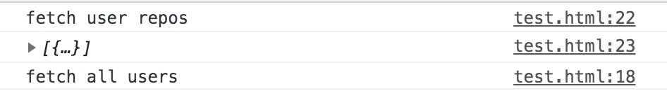
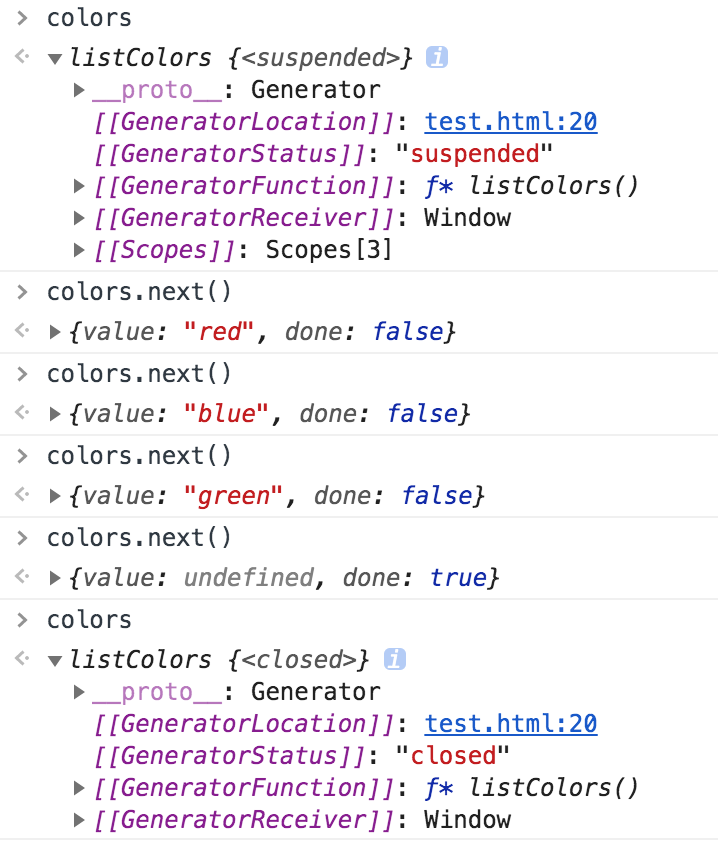
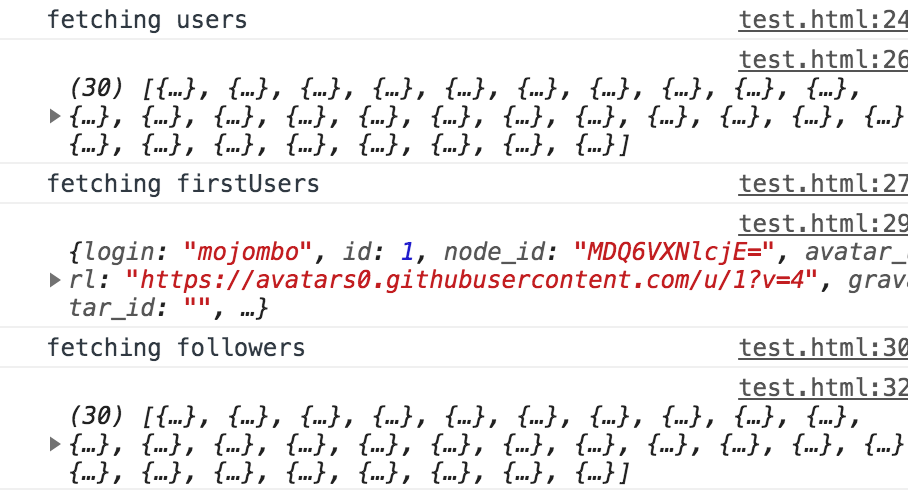

# Promise

我们在进行Ajax请求时，有时候可能会需要第一个请求执行成功再执行第二个请求.

```
let user;
$.get('https://api.github.com/users', data => {
    console.log('fetch all users')
    user = data[0].login;
})
$.get(`https://api.github.com/users/${user}/repos`, data => {
    console.log('fetch user repos')
    console.log(data)
})

```


我们可以看到，这个返回结果跟我们想的并不一样，返回数据的顺序是不确定的。为了确保第二个请求是在第一个请求之后发生的，我们会把第二个请求写到第一个请求的回调当中。像这样：

```
let user;
$.get('https://api.github.com/users', data => {
    console.log('fetch all users')
    user = data[0].login;

    $.get(`https://api.github.com/users/${user}/repos`, data => {
        console.log('fetch user repos')
        console.log(data)
    })
})

```

如果我们还需要第三个请求，我们就需要把第三个请求放到第二个请求中。但是这样的嵌套多了，可能会让我们陷入回调地狱，由于嵌套的函数过多，代码不仅可读性差，而且很难维护。


于是，promise就应运而生了。

Promise是异步编程的解决方案，比传统的回调函数和事件更合理和强大，简单来说，就是一个容器，里面保存着某个未来才会结束的事情，比较常见的使用场景就是进行网络请求:下面的示例中，我们使用了网络请求的库axios,这个方法返回的值就是一个promise。

```
const usersPromise = axios.get('https://api.github.com/users')//这行代码会给我们返回一个promise请求

usersPromise.then(res => {//当上面的请求成功了，我们就会获取到返回值,并进入到then函数
    userName = res.data[0].login;
    return axios.get(`https://api.github.com/users/${userName}/repos`)//开始第二个请求
}).then(res => {//第二个请求成功后，进入自己的then函数，打印返回值
    console.log(res.data)
})
.catch(err=>{
    console.error(err);如果发生错误，则打印错误信息
})

```

## Promise的基本使用

promise对象不受外界的影响，代表着一个异步操作，它有三种状态:pending,fulfilled和rejected,只有异步操作的结果可以决定它当前是什么状态，任何其他操作都无法改变这个状态。

Promise无法取消，一旦新建，就会执行，无法中途终端。并且，如果不设置回调函数，promise内部的错误外部无法得知，当pending的时候，无法知道进展到了哪一步。

我们有时候可能并不想使用上面的axios，而是想简单的自己使用一下promise，那么我们可以这么做:

```

const p = new Promise((res,rej)=>{
    res('bx is ok')
})

p.then(data=>{
    console.log("res:"data)
}).catch(err=>{
    console.log("rej:"err)
})

```

如上所示，promise接受两个参数，resolve和reject,分别代表成功和失败的状态。上面代码的意思时，我准备先去做一些别的事情，p，你先自己执行，如果成功了或者失败了，告诉我一下结果。

Promise的错误具有冒泡性质，会一直向后传递，直到被捕获为止，也就是说，错误总会被下一个catch语句捕获。

比如我们可以在promise查询数据库，进行网络请求，我们不可能一直卡在这里等他完成，否则可能会没办法执行下面的所有的内容，那我们现在就是让promise自己做自己的事情，我们去做一些别的事情。

```
const p = new Promise((res,rej)=>{
    setTimeout(()=>{
        res('now is ok');
        rej(Error('not ok'))
    },2000)
})

p.then(data=>{
    console.log(data)
})
.catch(err=>{
    console.error(err)
})

```

下面的代码，是根据id在数据库中匹配数据，匹配成功后将第二个数组中的owner赋值给第一个的owner,然后输出最后的结果。

```
const repos = [
    {name:'grit',owner:'mom',description:'beautiful',id:1},
    {name:'core',owner:'cat',description:'cute',id:2}
]

const owners = [
    {name:'mom',location:'Beijing',followers:123},
    {name:'cats',location:'Xian',followers:456}
]

function getRepoById(id){
    return new Promise((res,rej)=>{
        const repo = repos.find(repo=>repo.id===id)
        if(repo){
            res(repo)
        }else{
            rej(Error('no repo found'))
        }
    })
}

function comboundOwner(repo){
    return new Promise((res,rej)=>{
        const owner = owners.find(owner=>owner.name === repo.owner)
        if(owner){
            repo.owner = owner
            res(repo)
        }else{
            rej(Error('can not found the owner'))
        }
    })
}

getRepoById(1)
    .then(repo=>{
        return comboundOwner(repo)//第一个函数执行成功后，执行第二个函数，所以此处应该return一个promise出去。
    })
    .then(repo=>{
        console.log(repo)
    })
    .catch(err=>{
        console.error(err)
    })
```

# Generator生成器函数
```
function* listColors(){
    yield 'red';
    yield 'blue';
    yield 'green';
}
```


我们可以看到，生成器函数是随时可以暂停的，我们需要不断通过next方法来使他继续推进，利用生成器函数的这个特性，我们可以完成上面我们用Promise实现的功能：

```
function ajax(url){
    axios.get(url).then(res=>userGen.next(res.data))
}

function* step(){
    console.log('fetching users')
    const users = yield ajax('https://api.github.com/users');//3.执行第一步：通过axios获取到相应的数据，并将返回结果传递给next方法，进行下一步操作。
    console.log(users)
    console.log('fetching firstUsers')
    const firstUser = yield ajax(`https://api.github.com/users/${users[0].login}`);//4.收到上一步的请求结果，进行下一步的网络请求，并将返回结果传递给next方法，进行下一步操作。
    console.log(firstUser)
    console.log('fetching followers')
    const followers = yield ajax(firstUser.followers_url);//5.收到上一步的请求结果，进行下一步的网络请求，并将返回数据传递给followers。
    console.log(followers)
}
const userGen = step();//1.将step生成器赋值给userGen，此时userGen的状态是suspended。
userGen.next()//2.调用userGen的next方法，此时开始第一步的执行。

```


这样的结构不仅更有可读性，并且会让我们的代码更加优雅。

# Symbol数据类型

symbol是用来创建一个唯一的标识符，用来解决对象属性命名冲突的问题。我们来看一下以下示例：

```
const peter = Symbol();
const lily = Symbol();
console.log(peter==lily);//false

```

可以看到，虽然peter和lily都是Symbol,但是他们并不一样。

```
const classroom = {
    [Symbol('nina')]: { grade: 77, gender: female },
    [Symbol('nina')]: { grade: 80, gender: female }
}

```

Symbol的值不能与其他数据进行运算，包括同字符串进行拼接。并且，for in和for of等遍历时，也不会遍历Symbol属性。

# class原型继承

ES5中的原型继承，如下所示
```
function User(name,email){
    this.name = name;
    this.email =email;
    this.sayName = function(){
        console.log(`i am ${this.name}`)
    }
}
User.prototype.sayEmail = function(){
    console.log(`i am ${this.email}`)
}
const bx = new User('bx','bx@bx.com')

```

在ES6中，我们可以通过两种方式定义类：

*  类的声明
```
class User{}
```
* 类的表达式

```
const user = class {}
```

可以看出，类的定义方式和函数是一样的，我们输出一下class的类型，可以看到，类其实就是function，但是，即使是用类的声明来定义类，也不可以在定义之前使用，因为类不存在函数提升。

```
class User{
    constructor(name,email){
        this.name = name;
        this.email =email;
    }
    info(){
        console.log(`i am ${this.email}`)
    }
    static description(){//静态方法只能在原型对象上调用，而不能在实例上调用
        console.log(`i am a user of bx2651.com`)
    }
    set github(value){
        this.githubName = value
    }
    get github(){
        return `https://github.com/${this.githubName}`
    }
}

const bx = new User('bx','bx@bx.com')
```

那么，class是如何实现继承的呢？

```
class Animal {
    constructor(name){
        this.name = name;
        this.belly = []
    }
    eat(food){
        this.belly.push(food)
    }
}

class Dog extends Animal{
    constructor(name,age){
        //super方法的调用，就相当于我们在es5中写的三行代码：
        //Animal.call(this,name,age)
        //Dog.prototype = new Animal()
        //Dog.prototype.constructor = Dog
        super(name,age);
    }
    bark(){
        console.log(`Bark bark`)
    }
}

const lucky = new Dog('lucky',2)
```